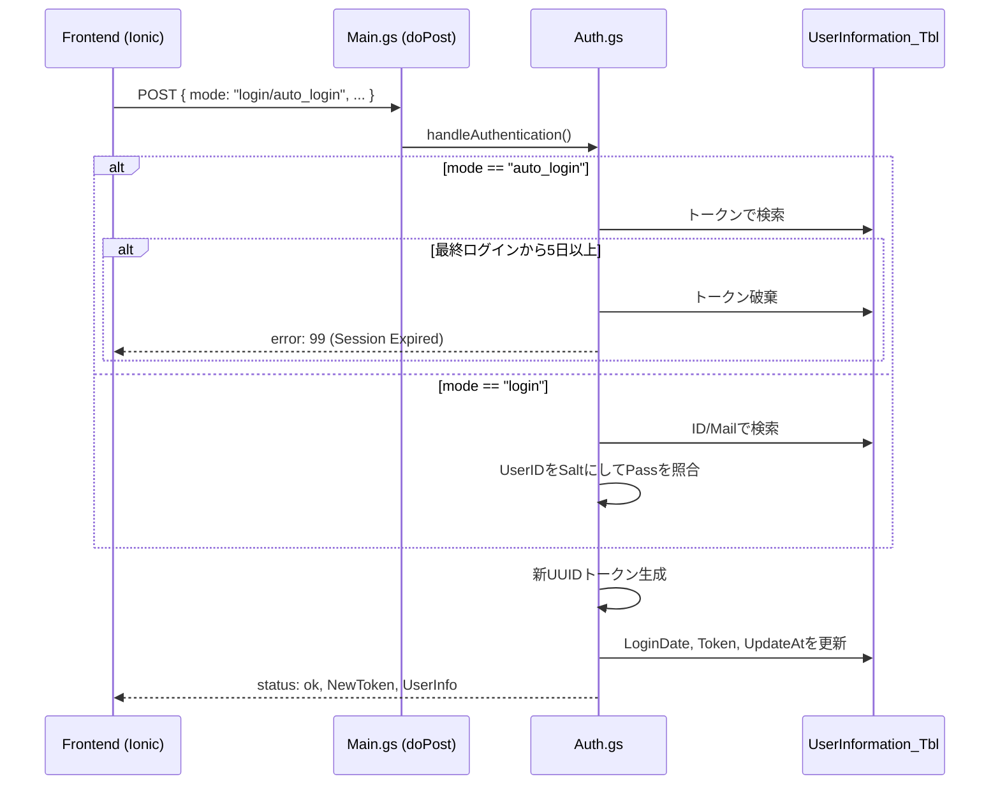

# MiniSNS プロジェクト概要設計書 & 環境構築ガイド
---

## 1. プロジェクト概要

スプレッドシートをデータベースとして活用し、Ionic/Reactフロントエンドと連携する軽量SNSバックエンドシステム。

### ドライブ構成・ディレクトリ構造

Googleドライブ内の構成を以下のように定義します。

```
Google Drive
└── MiniSNS/ (Root Folder)
    ├── MiniSNSDB (Google Spreadsheet: データベース本体)
    ├── BordAppAPIs (GAS Project: バックエンドプログラム)
    └── image/ (Folder: プロフィール画像・投稿画像保存用)
```

---

## 2. Googleドライブ適用・セットアップ手順

開発を開始する前に、以下の手順でインフラ環境を構築してください。

### ステップ1：フォルダとファイルの作成

1. Googleドライブに `MiniSNS` フォルダを作成する
2. その中に `image` フォルダを作成し、共有設定を「リンクを知っている全員：閲覧者」に変更する（アプリから画像を表示するため）
3. MiniSNS 直下に新しいスプレッドシートを作成し、名前を `MiniSNSDB` とする

### ステップ2：データベース（シート）の初期化

以下の3つのシートを作成し、1行目に項目名を記述します。

**UserInformation_Tbl**
- UserID, UserName, Mail, CreatedAt, Authority, UpdateAt, DeleteFlag, LoginDate, LoginToken, password, ProfileTxt, ProfileImageID

**Bord_Tbl**
- PostID, UserID, PostTxt, PostDate, UpdateDate, DeleteFlag

**Reply_Tbl**
- ReplyID, PostID, UserID, ReplyTxt, ReplyDate, UpdateDate, DeleteFlag

### ステップ3：GASプロジェクトの紐付け

1. スプレッドシートのメニューから「拡張機能」> 「Apps Script」を選択
2. プロジェクト名を `BordAppAPIs` に変更
3. エディタ左側の「＋」ボタンから、以下の順でスクリプトファイル（.gs）を作成する

```
Main.gs / Auth.gs / BordOperation.gs / ReplyOperation.gs / Common.gs / Config.gs / registAdmin.gs
```

---

## 3. GAS ファイル構成と役割

| ファイル名 | 役割 |
|-----------|------|
| Main.gs | APIエントリポイント。doGet / doPost によるルーティング |
| Auth.gs | ログイン、自動ログイン(トークン照合)、ユーザー登録処理 |
| BordOperation.gs | 掲示板への投稿作成、取得、削除処理 |
| ReplyOperation.gs | 投稿に対する返信の作成、取得、削除処理 |
| Common.gs | ハッシュ化、レスポンス生成、トークン検証等の共通関数 |
| Config.gs | シートID、フォルダID、バリデーション定数の定義 |
| registAdmin.gs | 初期管理者ユーザー登録用スクリプト |

---

## 4. 処理シーケンス

### 4.1 認証プロセス (Auth.gs)

トークン認証時には「5日ルール」を適用し、期限切れの場合はトークンを無効化（エラー99）します。



---

## 5. セキュリティ・運用ルール

- **パスワード保存**: SHA-256(password + UserID) でハッシュ化して保存
- **トークン更新**: 認証成功のたびにUUIDを再発行し、フロントエンドに返す（スライディングセッション方式）
- **論理削除**: データを物理削除せず DeleteFlag を 1 に更新し、取得系APIのフィルタ対象とする
- **画像管理**: ProfileImageID は image フォルダ内のファイルIDや、シート内の最大数値を取得した `prf_(N+1)` 形式で管理
- **CORS対策**: 全てのレスポンスは ContentService を経由させ、MIMEタイプを JSON に固定

---

## 6. API 仕様サマリー

### POST リクエスト

| mode | 説明 |
|------|------|
| "login" | ID/Mail + Passで認証 |
| "auto_login" | 保存済みトークンによる自動認証 |
| "registUser" | 新規ユーザー登録 |
| "createPost" | 新規投稿（要トークン） |
| "createReply" | 返信投稿（要トークン） |

### GET リクエスト

| mode | 説明 |
|------|------|
| "getPosts" | 有効な投稿一覧の取得 |
| "getReplies" | 特定PostIDに紐づく返信一覧の取得 |